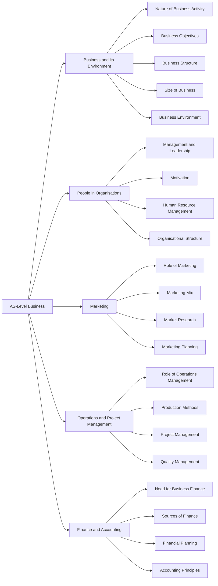

# 2iec business

```mermaid
graph LR
    A[AS-Level Business]
    A --> B[Business and its Environment]
    A --> C[People in Organisations]
    A --> D[Marketing]
    A --> E[Operations and Project Management]
    A --> F[Finance and Accounting]

    B --> B1[Nature of Business Activity]
    B --> B2[Business Objectives]
    B --> B3[Business Structure]
    B --> B4[Size of Business]
    B --> B5[Business Environment]

    C --> C1[Management and Leadership]
    C --> C2[Motivation]
    C --> C3[Human Resource Management]
    C --> C4[Organisational Structure]

    D --> D1[Role of Marketing]
    D --> D2[Marketing Mix]
    D --> D3[Market Research]
    D --> D4[Marketing Planning]

    E --> E1[Role of Operations Management]
    E --> E2[Production Methods]
    E --> E3[Project Management]
    E --> E4[Quality Management]

    F --> F1[Need for Business Finance]
    F --> F2[Sources of Finance]
    F --> F3[Financial Planning]
    F --> F4[Accounting Principles]
```