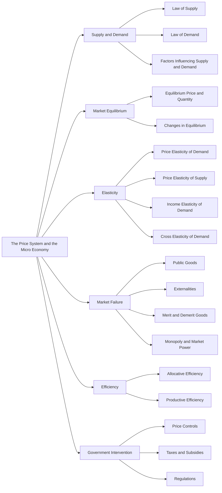

# 2iec economics - basic economic problem

```mermaid
graph LR
    A[The Price System and the Micro Economy]
    A --> B[Supply and Demand]
    A --> C[Market Equilibrium]
    A --> D[Elasticity]
    A --> E[Market Failure]
    A --> F[Efficiency]
    A --> G[Government Intervention]

    B --> B1[Law of Supply]
    B --> B2[Law of Demand]
    B --> B3[Factors Influencing Supply and Demand]

    C --> C1[Equilibrium Price and Quantity]
    C --> C2[Changes in Equilibrium]

    D --> D1[Price Elasticity of Demand]
    D --> D2[Price Elasticity of Supply]
    D --> D3[Income Elasticity of Demand]
    D --> D4[Cross Elasticity of Demand]

    E --> E1[Public Goods]
    E --> E2[Externalities]
    E --> E3[Merit and Demerit Goods]
    E --> E4[Monopoly and Market Power]

    F --> F1[Allocative Efficiency]
    F --> F2[Productive Efficiency]

    G --> G1[Price Controls]
    G --> G2[Taxes and Subsidies]
    G --> G3[Regulations]
```