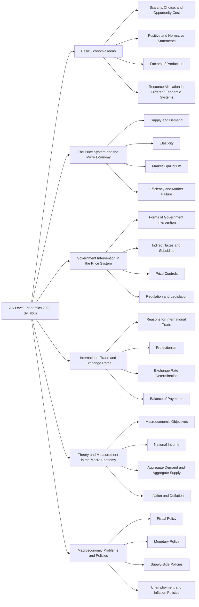

# 2iec economics

```mermaid
graph LR
    A[AS-Level Economics 2023 Syllabus]
    A --> B[Basic Economic Ideas]
    A --> C[The Price System and the Micro Economy]
    A --> D[Government Intervention in the Price System]
    A --> E[International Trade and Exchange Rates]
    A --> F[Theory and Measurement in the Macro Economy]
    A --> G[Macroeconomic Problems and Policies]

    B --> B1[Scarcity, Choice, and Opportunity Cost]
    B --> B2[Positive and Normative Statements]
    B --> B3[Factors of Production]
    B --> B4[Resource Allocation in Different Economic Systems]

    C --> C1[Supply and Demand]
    C --> C2[Elasticity]
    C --> C3[Market Equilibrium]
    C --> C4[Efficiency and Market Failure]

    D --> D1[Forms of Government Intervention]
    D --> D2[Indirect Taxes and Subsidies]
    D --> D3[Price Controls]
    D --> D4[Regulation and Legislation]

    E --> E1[Reasons for International Trade]
    E --> E2[Protectionism]
    E --> E3[Exchange Rate Determination]
    E --> E4[Balance of Payments]

    F --> F1[Macroeconomic Objectives]
    F --> F2[National Income]
    F --> F3[Aggregate Demand and Aggregate Supply]
    F --> F4[Inflation and Deflation]

    G --> G1[Fiscal Policy]
    G --> G2[Monetary Policy]
    G --> G3[Supply-Side Policies]
    G --> G4[Unemployment and Inflation Policies]
```