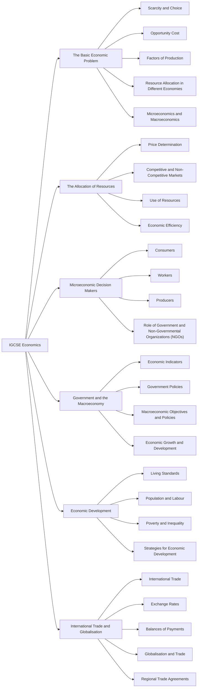

# 3iec economics

```mermaid
graph LR
    A[IGCSE Economics]
    A --> B[The Basic Economic Problem]
    A --> C[The Allocation of Resources]
    A --> D[Microeconomic Decision Makers]
    A --> E[Government and the Macroeconomy]
    A --> F[Economic Development]
    A --> G[International Trade and Globalisation]

    B --> B1[Scarcity and Choice]
    B --> B2[Opportunity Cost]
    B --> B3[Factors of Production]
    B --> B4[Resource Allocation in Different Economies]
    B --> B5[Microeconomics and Macroeconomics]

    C --> C1[Price Determination]
    C --> C2[Competitive and Non-Competitive Markets]
    C --> C3[Use of Resources]
    C --> C4[Economic Efficiency]

    D --> D1[Consumers]
    D --> D2[Workers]
    D --> D3[Producers]
    D --> D4["Role of Government and Non-Governmental Organizations (NGOs)"]

    E --> E1[Economic Indicators]
    E --> E2[Government Policies]
    E --> E3[Macroeconomic Objectives and Policies]
    E --> E4[Economic Growth and Development]

    F --> F1[Living Standards]
    F --> F2[Population and Labour]
    F --> F3[Poverty and Inequality]
    F --> F4[Strategies for Economic Development]

    G --> G1[International Trade]
    G --> G2[Exchange Rates]
    G --> G3[Balances of Payments]
    G --> G4[Globalisation and Trade]
    G --> G5[Regional Trade Agreements]
```